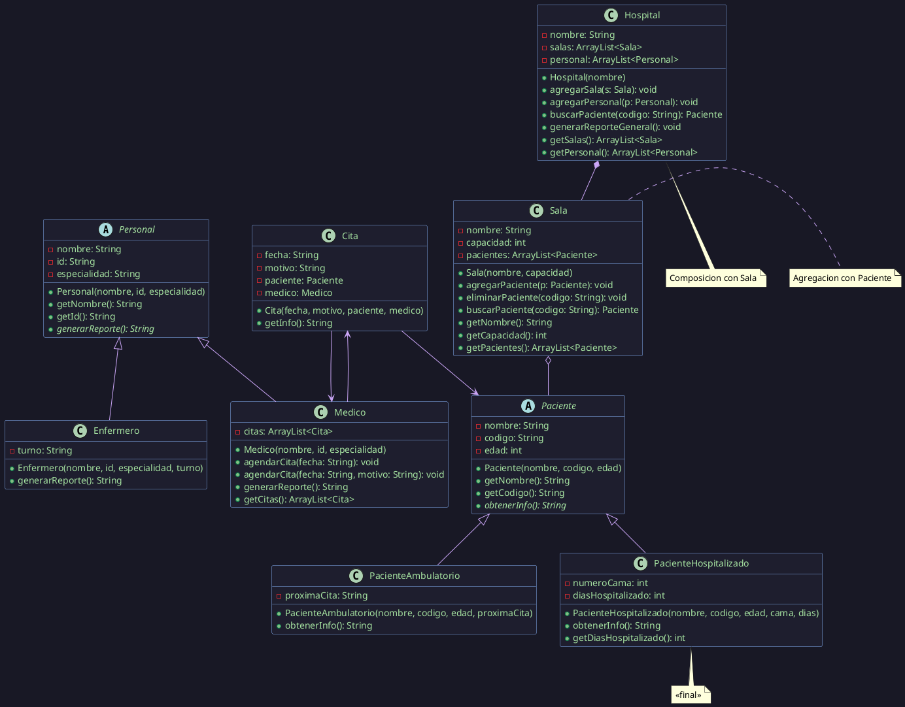

# Proyecto Final — Programación Orientada a Objetos
## Sistema de Gestión Hospitalaria
**Equipos:** 2 o 3 personas · **Plazo:** 1 semana · **Entrega:** Código fuente + diagrama de clases

---

## Contexto

Un hospital regional necesita un sistema de software para gestionar sus operaciones internas: administrar salas, registrar pacientes, organizar el personal médico y programar citas. Tu equipo debe diseñar e implementar este sistema aplicando todos los principios de la Programación Orientada a Objetos vistos durante el curso.

El sistema debe funcionar desde consola con un menú interactivo y manejar correctamente los errores que puedan ocurrir en tiempo de ejecución.

---

## Diagrama de clases requerido



> **Cómo generar el diagrama:**
> 1. Copia el bloque entre ` ```plantuml ` y ` ``` `
> 2. Ve a [plantuml.com/plantuml](https://www.plantuml.com/plantuml/uml/) y pégalo
> 3. Descarga la imagen SVG o PNG
> 4. En tu `.md` incorpórala así: ``
>
> **Alternativa VS Code:** instala la extensión *PlantUML* de jebbs y presiona `Alt+D` para previsualizar.

---

## Estructura de paquetes requerida

```
SistemaHospital/
└── src/
    ├── com/hospital/modelo/
    │   ├── Personal.java           ← abstracta
    │   ├── Medico.java
    │   ├── Enfermero.java
    │   ├── Paciente.java           ← abstracta
    │   ├── PacienteAmbulatorio.java
    │   ├── PacienteHospitalizado.java  ← final
    │   ├── Cita.java
    │   ├── Sala.java
    │   └── Hospital.java
    ├── com/hospital/excepciones/
    │   ├── CamaNoDisponibleException.java
    │   ├── PacienteNoEncontradoException.java
    │   └── CitaInvalidaException.java
    └── com/hospital/app/
        └── App.java
```

---

## Especificación de clases

---

### Paquete `com.hospital.excepciones`

Crea las tres excepciones personalizadas antes de cualquier otra clase — las necesitarás en todo el proyecto.

**`CamaNoDisponibleException`**
```
PSEUDOCÓDIGO:
  Extiende Exception
  Constructor recibe mensaje String
  Llama super(mensaje)
```

**`PacienteNoEncontradoException`**
```
PSEUDOCÓDIGO:
  Extiende Exception
  Constructor recibe codigo String
  Llama super("Paciente con código " + codigo + " no encontrado.")
```

**`CitaInvalidaException`**
```
PSEUDOCÓDIGO:
  Extiende Exception
  Constructor recibe mensaje String
  Llama super(mensaje)
```

---

### Paquete `com.hospital.modelo`

---

#### Clase abstracta `Personal`

Representa a cualquier miembro del personal del hospital. Nadie es "personal genérico" — siempre es médico o enfermero.

**Atributos:**

| Atributo | Tipo | Visibilidad |
|---|---|---|
| `nombre` | String | private |
| `id` | String | private |
| `especialidad` | String | private |

**Constructor:**
```
PSEUDOCÓDIGO:
  Recibe nombre, id, especialidad
  Asigna cada uno a sus atributos
```

**Métodos:**
- `getNombre()`, `getId()`, `getEspecialidad()` — retornan el atributo correspondiente
- `generarReporte()` — **abstracto**: cada tipo de personal genera su reporte diferente

---

#### Clase `Medico` — extiende `Personal`

**Atributos adicionales:**

| Atributo | Tipo | Visibilidad |
|---|---|---|
| `citas` | ArrayList\<Cita\> | private |

**Constructor:**
```
PSEUDOCÓDIGO:
  Llama super(nombre, id, especialidad)
  Inicializa citas como ArrayList vacío
```

**Métodos:**

`agendarCita(fecha)` *(primera versión — SOBRECARGA)*
```
PSEUDOCÓDIGO:
  SI fecha es nula o vacía ENTONCES
    lanzar CitaInvalidaException("La fecha no puede estar vacía.")
  FIN SI
  Crear nueva Cita con fecha, motivo="Consulta general", paciente=null, medico=this
  Agregar cita a la lista citas
  Imprimir "Cita agendada para " + fecha
```

`agendarCita(fecha, motivo)` *(segunda versión — SOBRECARGA)*
```
PSEUDOCÓDIGO:
  SI fecha es nula o vacía ENTONCES
    lanzar CitaInvalidaException("La fecha no puede estar vacía.")
  FIN SI
  SI motivo es nulo o vacío ENTONCES
    lanzar CitaInvalidaException("El motivo no puede estar vacío.")
  FIN SI
  Crear nueva Cita con fecha, motivo, paciente=null, medico=this
  Agregar cita a la lista citas
  Imprimir "Cita agendada para " + fecha + " por: " + motivo
```

> Estas dos versiones constituyen el **polimorfismo estático (sobrecarga)**.

`generarReporte()` *(SOBREESCRITURA de Personal — POLIMORFISMO DINÁMICO)*
```
PSEUDOCÓDIGO:
  RETORNAR "=== MÉDICO ===" +
           "\nNombre: " + nombre +
           "\nID: " + id +
           "\nEspecialidad: " + especialidad +
           "\nCitas agendadas: " + citas.size()
```

`getCitas()` — retorna la lista de citas.

---

#### Clase `Enfermero` — extiende `Personal`

**Atributos adicionales:**

| Atributo | Tipo | Visibilidad |
|---|---|---|
| `turno` | String | private |

**Constructor:**
```
PSEUDOCÓDIGO:
  Llama super(nombre, id, especialidad)
  Asigna turno
```

**Métodos:**

`generarReporte()` *(SOBREESCRITURA — POLIMORFISMO DINÁMICO)*
```
PSEUDOCÓDIGO:
  RETORNAR "=== ENFERMERO ===" +
           "\nNombre: " + nombre +
           "\nID: " + id +
           "\nEspecialidad: " + especialidad +
           "\nTurno: " + turno
```

---

#### Clase abstracta `Paciente`

Representa a cualquier paciente del hospital. Nadie es "paciente genérico".

**Atributos:**

| Atributo | Tipo | Visibilidad |
|---|---|---|
| `nombre` | String | private |
| `codigo` | String | private |
| `edad` | int | private |

**Constructor:**
```
PSEUDOCÓDIGO:
  Recibe nombre, codigo, edad
  SI edad < 0 O edad > 120 ENTONCES
    lanzar IllegalArgumentException("Edad inválida: " + edad)
  FIN SI
  Asigna cada atributo
```

**Métodos:**
- `getNombre()`, `getCodigo()`, `getEdad()` — retornan el atributo
- `obtenerInfo()` — **abstracto**: cada tipo de paciente muestra su info diferente

---

#### Clase `PacienteAmbulatorio` — extiende `Paciente`

Un paciente ambulatorio no ocupa cama — viene a consulta y se va.

**Atributos adicionales:**

| Atributo | Tipo | Visibilidad |
|---|---|---|
| `proximaCita` | String | private |

**Constructor:**
```
PSEUDOCÓDIGO:
  Llama super(nombre, codigo, edad)
  Asigna proximaCita
```

**Métodos:**

`obtenerInfo()` *(SOBREESCRITURA — POLIMORFISMO DINÁMICO)*
```
PSEUDOCÓDIGO:
  RETORNAR "Paciente ambulatorio: " + nombre +
           " | Código: " + codigo +
           " | Edad: " + edad +
           " | Próxima cita: " + proximaCita
```

---

#### Clase `PacienteHospitalizado` — extiende `Paciente` · **`final`**

> ⚠ Esta clase debe declararse `final` — no puede heredarse.

Un paciente hospitalizado ocupa una cama y lleva días de estadía.

**Atributos adicionales:**

| Atributo | Tipo | Visibilidad |
|---|---|---|
| `numeroCama` | int | private |
| `diasHospitalizado` | int | private |

**Constructor:**
```
PSEUDOCÓDIGO:
  Llama super(nombre, codigo, edad)
  SI numeroCama <= 0 ENTONCES
    lanzar IllegalArgumentException("Número de cama inválido.")
  FIN SI
  Asigna numeroCama y diasHospitalizado
```

**Métodos:**

`obtenerInfo()` *(SOBREESCRITURA — POLIMORFISMO DINÁMICO)*
```
PSEUDOCÓDIGO:
  RETORNAR "Paciente hospitalizado: " + nombre +
           " | Código: " + codigo +
           " | Edad: " + edad +
           " | Cama: " + numeroCama +
           " | Días: " + diasHospitalizado
```

`getDiasHospitalizado()` — retorna diasHospitalizado.

---

#### Clase `Cita`

Representa la asociación entre un médico y un paciente en una fecha y con un motivo.

**Atributos:**

| Atributo | Tipo | Visibilidad |
|---|---|---|
| `fecha` | String | private |
| `motivo` | String | private |
| `paciente` | Paciente | private |
| `medico` | Medico | private |

**Constructor:**
```
PSEUDOCÓDIGO:
  Recibe fecha, motivo, paciente, medico
  Asigna cada uno
```

**Métodos:**

`getInfo()`
```
PSEUDOCÓDIGO:
  RETORNAR "Cita: " + fecha +
           " | Motivo: " + motivo +
           " | Médico: " + medico.getNombre() +
           " | Paciente: " + (paciente != null ? paciente.getNombre() : "sin asignar")
```

`getPaciente()`, `getMedico()`, `getFecha()` — retornan el atributo.

---

#### Clase `Sala`

Agrupa pacientes. La sala puede existir sin pacientes, y los pacientes pueden existir sin sala — esto es **agregación**.

**Atributos:**

| Atributo | Tipo | Visibilidad |
|---|---|---|
| `nombre` | String | private |
| `capacidad` | int | private |
| `pacientes` | ArrayList\<Paciente\> | private |

**Constructor:**
```
PSEUDOCÓDIGO:
  Recibe nombre, capacidad
  SI capacidad <= 0 ENTONCES
    lanzar IllegalArgumentException("Capacidad debe ser mayor a 0.")
  FIN SI
  Inicializa pacientes como ArrayList vacío
```

**Métodos:**

`agregarPaciente(paciente)` — lanza `CamaNoDisponibleException`
```
PSEUDOCÓDIGO:
  SI pacientes.size() >= capacidad ENTONCES
    lanzar CamaNoDisponibleException("Sala " + nombre + " sin camas disponibles.")
  FIN SI
  Agregar paciente a la lista
  Imprimir "Paciente " + paciente.getNombre() + " asignado a sala " + nombre
```

`eliminarPaciente(codigo)` — lanza `PacienteNoEncontradoException`
```
PSEUDOCÓDIGO:
  PARA CADA paciente EN pacientes HACER
    SI paciente.getCodigo() igual a codigo ENTONCES
      Eliminar paciente de la lista
      Imprimir "Paciente dado de alta."
      RETORNAR
    FIN SI
  FIN PARA
  lanzar PacienteNoEncontradoException(codigo)
```

`buscarPaciente(codigo)` — lanza `PacienteNoEncontradoException`
```
PSEUDOCÓDIGO:
  PARA CADA paciente EN pacientes HACER
    SI paciente.getCodigo() igual a codigo ENTONCES
      RETORNAR paciente
    FIN SI
  FIN PARA
  lanzar PacienteNoEncontradoException(codigo)
```

`getNombre()`, `getCapacidad()`, `getPacientes()` — retornan el atributo.

`listarPacientes()`
```
PSEUDOCÓDIGO:
  SI pacientes está vacío ENTONCES
    Imprimir "No hay pacientes en esta sala."
    RETORNAR
  FIN SI
  PARA CADA paciente EN pacientes HACER
    Imprimir paciente.obtenerInfo()   // POLIMORFISMO DINÁMICO
  FIN PARA
```

---

#### Clase `Hospital`

Contiene salas y personal. Si el hospital desaparece, sus salas también — esto es **composición**.

**Atributos:**

| Atributo | Tipo | Visibilidad |
|---|---|---|
| `nombre` | String | private |
| `salas` | ArrayList\<Sala\> | private |
| `personal` | ArrayList\<Personal\> | private |

**Constructor:**
```
PSEUDOCÓDIGO:
  Recibe nombre
  Inicializa salas y personal como ArrayList vacíos
  Crea internamente las salas del hospital (mínimo 3):
    new Sala("Urgencias", 10)
    new Sala("Pediatria", 8)
    new Sala("Cirugia", 6)
  Agrega las salas a la lista
```

**Métodos:**

`agregarPersonal(personal)`
```
PSEUDOCÓDIGO:
  Agregar personal a la lista
  Imprimir personal.getNombre() + " registrado en el hospital."
```

`buscarSala(nombreSala)` — retorna `Sala`
```
PSEUDOCÓDIGO:
  PARA CADA sala EN salas HACER
    SI sala.getNombre() igual a nombreSala ENTONCES
      RETORNAR sala
    FIN SI
  FIN PARA
  RETORNAR null
```

`buscarPaciente(codigo)` — lanza `PacienteNoEncontradoException`
```
PSEUDOCÓDIGO:
  PARA CADA sala EN salas HACER
    INTENTAR
      RETORNAR sala.buscarPaciente(codigo)
    CAPTURAR PacienteNoEncontradoException
      // no está en esta sala, seguir buscando
    FIN INTENTAR
  FIN PARA
  lanzar PacienteNoEncontradoException(codigo)
```

`generarReporteGeneral()`
```
PSEUDOCÓDIGO:
  Imprimir "=== REPORTE GENERAL: " + nombre + " ==="
  PARA CADA sala EN salas HACER
    Imprimir "Sala: " + sala.getNombre() +
             " | Ocupación: " + sala.getPacientes().size() +
             "/" + sala.getCapacidad()
  FIN PARA
  Imprimir "Personal registrado: " + personal.size()
  PARA CADA p EN personal HACER
    Imprimir p.generarReporte()   // POLIMORFISMO DINÁMICO
  FIN PARA
```

`getSalas()`, `getPersonal()` — retornan la lista.

---

### Paquete `com.hospital.app`

#### Clase `App` — menú principal

```
PSEUDOCÓDIGO:
  Crear hospital "Hospital Regional San Juan"
  Crear médicos:
    Medico m1 = new Medico("Dra. Laura Gomez", "M001", "Cardiologia")
    Medico m2 = new Medico("Dr. Pedro Ruiz",   "M002", "Pediatria")
  Crear enfermeros:
    Enfermero e1 = new Enfermero("Ana Torres", "E001", "Cuidados intensivos", "Mañana")
  Registrar personal en el hospital

  REPETIR
    Imprimir menú:
      1. Registrar paciente
      2. Asignar paciente a sala
      3. Agendar cita con médico
      4. Ver pacientes de una sala
      5. Ver agenda de un médico
      6. Dar de alta a paciente
      7. Buscar paciente por código
      8. Reporte general del hospital
      0. Salir
    Leer opción

    SEGÚN opción HACER
      CASO 1:
        Preguntar tipo (1=Ambulatorio, 2=Hospitalizado)
        Leer nombre, codigo, edad
        SI tipo == 1 ENTONCES
          Leer proximaCita
          Crear PacienteAmbulatorio
        SI NO
          Leer numeroCama, diasHospitalizado
          Crear PacienteHospitalizado
        FIN SI
        // Guardar paciente en una lista temporal para asignarlo luego

      CASO 2:
        Listar salas disponibles con su ocupación
        Leer nombre de sala
        Buscar sala en hospital
        Leer codigo del paciente a asignar
        Buscar paciente en lista temporal
        INTENTAR
          sala.agregarPaciente(paciente)
        CAPTURAR CamaNoDisponibleException
          Imprimir "Error: " + e.getMessage()
        FIN INTENTAR

      CASO 3:
        Listar médicos disponibles
        Leer id del médico
        Preguntar si agrega motivo (s/n)
        Leer fecha
        INTENTAR
          SI con motivo ENTONCES
            Leer motivo
            medico.agendarCita(fecha, motivo)
          SI NO
            medico.agendarCita(fecha)
          FIN SI
        CAPTURAR CitaInvalidaException
          Imprimir "Error: " + e.getMessage()
        FIN INTENTAR

      CASO 4:
        Leer nombre de sala
        sala.listarPacientes()

      CASO 5:
        Leer id del médico
        PARA CADA cita EN medico.getCitas() HACER
          Imprimir cita.getInfo()
        FIN PARA

      CASO 6:
        Leer nombre de sala y codigo del paciente
        INTENTAR
          sala.eliminarPaciente(codigo)
        CAPTURAR PacienteNoEncontradoException
          Imprimir "Error: " + e.getMessage()
        FIN INTENTAR

      CASO 7:
        Leer codigo
        INTENTAR
          Paciente p = hospital.buscarPaciente(codigo)
          Imprimir p.obtenerInfo()
        CAPTURAR PacienteNoEncontradoException
          Imprimir "Error: " + e.getMessage()
        FIN INTENTAR

      CASO 8:
        hospital.generarReporteGeneral()

    FIN SEGÚN
  HASTA QUE opción == 0
```

---


---

## Modificadores de acceso — guía para este proyecto

Cada atributo y método tiene un modificador de acceso que debes aplicar conscientemente. La siguiente tabla indica cuál usar en cada caso y por qué:

### Atributos

| Clase | Atributo | Modificador | Por qué |
|---|---|---|---|
| `Personal` | `nombre`, `id`, `especialidad` | `private` | Solo se acceden desde dentro de `Personal` mediante getters |
| `Medico` | `citas` | `private` | Solo `Medico` gestiona su lista de citas |
| `Enfermero` | `turno` | `private` | Dato interno del enfermero, accesible solo con getter |
| `Paciente` | `nombre`, `codigo` | `private` | Ninguna subclase los accede directamente — usan `getNombre()` y `getCodigo()` |
| `Paciente` | `edad` | `private` | Igual — se expone con `getEdad()` |
| `PacienteAmbulatorio` | `proximaCita` | `private` | Solo esta clase la gestiona |
| `PacienteHospitalizado` | `numeroCama`, `diasHospitalizado` | `private` | Datos internos de la subclase |
| `Cita` | `fecha`, `motivo`, `paciente`, `medico` | `private` | Solo se acceden desde `Cita` mediante getters |
| `Sala` | `nombre`, `capacidad`, `pacientes` | `private` | `Hospital` interactúa con `Sala` solo mediante sus métodos públicos |
| `Hospital` | `nombre`, `salas`, `personal` | `private` | El estado del hospital se modifica solo a través de sus métodos |

### Métodos

| Método | Modificador | Por qué |
|---|---|---|
| Getters (`getNombre()`, etc.) | `public` | Son la interfaz controlada para leer atributos privados |
| Constructores | `public` | Cualquier clase necesita poder crear estos objetos |
| `generarReporte()` | `public` | Se llama desde `App` y desde `Hospital` |
| `obtenerInfo()` | `public` | Se llama desde `Sala.listarPacientes()` y desde `App` |
| `agendarCita()` | `public` | Se llama desde `App` |
| `agregarPaciente()`, `eliminarPaciente()` | `public` | Se llaman desde `App` |
| `generarReporteGeneral()` | `public` | Se llama desde `App` |

### Resumen visual

```
App (com.hospital.app)
  │
  │ usa métodos PUBLIC de:
  ▼
Hospital ──(composición)──► Sala ──(agregación)──► Paciente
  │                           │                      ▲
  │ ArrayList<Personal>        │ ArrayList<Paciente>   │ hereda
  ▼                           ▼                      │
Medico / Enfermero         listarPacientes()    Ambulatorio
  │                        agregarPaciente()    Hospitalizado
  │ ArrayList<Cita>        eliminarPaciente()
  ▼
Cita ──(asociación)──► Paciente
```

> **Nota sobre `protected`:** en este proyecto los atributos de las superclases (`Personal`, `Paciente`) son `private`. Las subclases acceden a ellos mediante los getters heredados — esto es encapsulamiento estricto. Si quisieras que `PacienteAmbulatorio` accediera directamente a `nombre` sin getter, lo declararías `protected` en `Paciente`. Ambos enfoques son válidos; en este proyecto se elige `private` + getter para practicar encapsulamiento completo.

---
## Requisitos de entrega

- [ ] Estructura de paquetes correcta (`modelo`, `excepciones`, `app`)
- [ ] `Personal` y `Paciente` declaradas como `abstract`
- [ ] `PacienteHospitalizado` declarada como `final`
- [ ] `Medico` con sobrecarga de `agendarCita` (dos versiones)
- [ ] `generarReporte()` sobreescrito en `Medico` y `Enfermero`
- [ ] `obtenerInfo()` sobreescrito en `PacienteAmbulatorio` y `PacienteHospitalizado`
- [ ] `Hospital` con composición hacia `Sala` (crea las salas en el constructor)
- [ ] `Sala` con agregación hacia `Paciente` (ArrayList)
- [ ] `Cita` como asociación entre `Medico` y `Paciente`
- [ ] Las tres excepciones personalizadas implementadas y lanzadas correctamente
- [ ] `App` con menú funcional que demuestre todos los escenarios
- [ ] Diagrama de clases en PlantUML

---

## Rúbrica

| Criterio | Puntos |
|---|---|
| Estructura de paquetes correcta | 5 |
| Jerarquía de herencia (`Personal` + `Paciente`) con clases abstractas | 15 |
| `PacienteHospitalizado` final y ambas subclases con sobreescritura | 10 |
| Composición `Hospital` → `Sala` | 10 |
| Agregación `Sala` → `Paciente` con ArrayList | 10 |
| Asociación `Medico` → `Cita` → `Paciente` | 10 |
| Polimorfismo estático: sobrecarga de `agendarCita` | 10 |
| Polimorfismo dinámico: `generarReporte()` y `obtenerInfo()` | 10 |
| Excepciones personalizadas lanzadas y capturadas correctamente | 10 |
| `App` con menú funcional y todos los escenarios demostrados | 5 |
| Diagrama de clases PlantUML correcto | 5 |
| **Total** | **100** |
